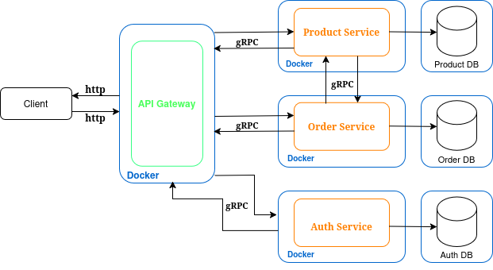
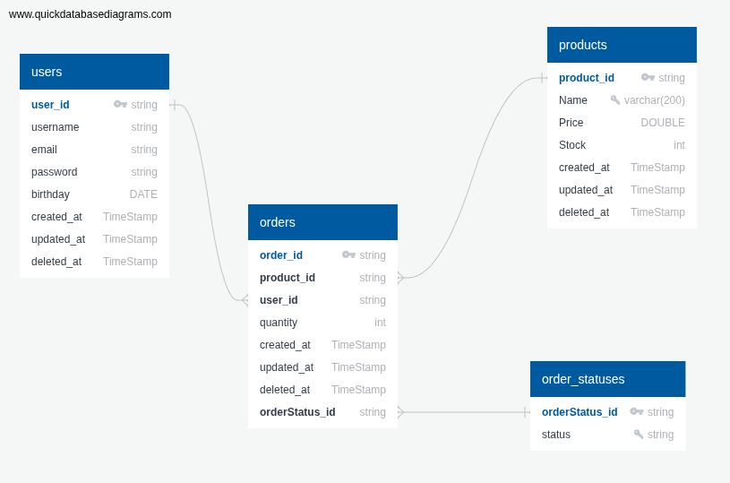

# Scalable online marketplace powered by microservices

## Current development:
Actively working on Dockerized microservice migrations.

## Next steps:
- Minimize Docker image size.
- Implement comprehensive logging across all services for enhanced observability and troubleshooting.
- Expand API surface by introducing new endpoints to support upcoming features.
- Integrate metrics collection
- Enable distributed tracing

### I'm actively developing and refining the project’s overall architecture to support future features and scalability.

## Long-term vision:
### Transition to an event-driven architecture to achieve greater decoupling, scalability, and real-time responsiveness across microservices.

## Project architecture:
 

## Database schema:

## Generated protobuf files:
## [marketplace-protos](https://github.com/shoksin/marketplace-protos) ##