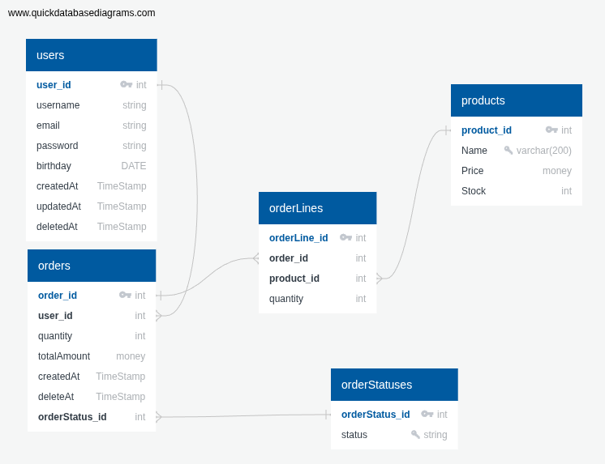

# Simple marketplace with microservices.

## Это бета-версия минимально рабочего прототипа маркетплейса. Ведётся активная работа над проетом
## Сейчас он сделан так, чтобы просто работал.

### The project is a microservice application for online shopping

## Project architecture:
 

## Database schema:

## Generated protobuf files:
## [marketplace-protos](https://github.com/shoksin/marketplace-protos) ##